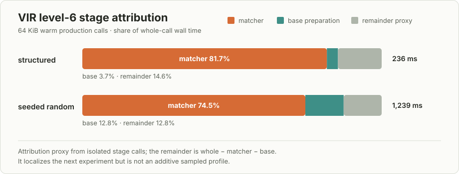

# VIR and FIR browser performance notes

These are local diagnostic results, not release claims. Every row used a fresh
browser worker, exact native lean-zip output comparison, and independent raw
inflate. All VIR rows use the package-set-lifetime cache landed in PR #131;
measurements from the known per-call-cache bug and deleted pre-merge worktree
are excluded.

## Artifact identity

- Chrome: headless 150.0.0.0 on Linux
- VIR main: `d43a947e65cec5dbda9e2393a5e74d1150ca144f`
  (`fix: persist IR interpreter caches across calls (#131)`)
- VIR profile: `client-native`
- VIR Wasm: 742,811 bytes,
  `a09ad75ada18d90c6aec881fdf5bd34537029c2c5be243e477102adb200e3f78`
- VIR browser runtime snapshot: 43 files / 925,039 bytes,
  `fbfda2cca0fb63ac69ffc43fbdd29ef107fa7807bdedce59f94a91fdcd5835df`
- VIR package input: 1,151,430 bytes,
  `3f3db6f2a75085f193e8dbe569d8b8ac53dceb9a789e2ef641df6665a711c1d7`
- FIR production-dispatcher producer: FIR `1d79658d`, lean-zip `30737b4e`
- FIR production levels 1–10 Wasm: 1,753,310 bytes,
  `0686e69684c187b1b14415f0f3b88fe4ce28514c97f8aac003fbd7359f15b838`
- FIR C/Emscripten producer: FIR `515bf401`, lean-zip `5c27bbd0`
- FIR C/Emscripten Wasm: 2,346,345 bytes,
  `8a37e8c76883c29c04b2e764482c62ec303344129b547b1f6a150a74a0c9ec7f`

## VIR compressed levels

Five browser samples at 64 KiB, after three excluded warmups, gave:

| input | level | native | VIR | VIR / native |
| --- | ---: | ---: | ---: | ---: |
| repeated text | 1 | 0.197 ms | 37.0 ms | 188x |
| repeated text | 6 | 0.766 ms | 209.1 ms | 273x |
| structured records | 1 | 0.142 ms | 47.8 ms | 338x |
| structured records | 6 | 0.865 ms | 352.6 ms | 408x |
| seeded random | 1 | 0.936 ms | 313.0 ms | 335x |
| seeded random | 6 | 4.00 ms | 1,330.9 ms | 333x |

Across these cells, VIR's `executeMs` accounts for 99.35–99.93% of its timed
steady call. Marshal, decode, and JavaScript host time do not explain the gap.
The wide client-native helpers execute inside the shared Wasm and are included
in `executeMs`.

The first compressed call remains intentionally cold. Compressible 64 KiB
inputs measured roughly 0.66–1.09 seconds before settling because the computed
32,769-entry distance table is constructed lazily. The fixed runtime retains
that value for the rest of the loaded package-set lifetime; it no longer pays
the cost on every public call.

Warm production-stage probes at level 6 further narrow the steady cost:

| 64 KiB input | whole | matcher | base preparation | remainder proxy |
| --- | ---: | ---: | ---: | ---: |
| structured records | 236 ms | 193 ms (81.7%) | 8.65 ms (3.7%) | 34.5 ms |
| seeded random | 1,239 ms | 923 ms (74.5%) | 158 ms (12.8%) | 158 ms |

The remainder is `whole - matcher - base` from isolated calls and is not an
additive profile. The direct level-6 entry emitted bytes identical to the whole
dispatcher. These results make the matcher/interpreter instruction path the
next VIR target; they do not support a JavaScript-boundary or missing-inline
explanation.

### VIR symbol-level attribution

A diagnostics-only Node/V8 profile then exercised the complete production
`VirLeanZipAcceptance.compressRaw` entry on Canterbury `alice29.txt` at level
6. The 152,089-byte input has SHA-256
`7467306ee0feed4971260f3c87421154a05be571d944e9cb021a5713700c38f0`;
the native-equal, independently inflatable 54,518-byte output has SHA-256
`762d58319c66b33a062da439d7bed7b33250493acb3bc2ceecdd05454ca34267`.
Two warmups, package loading, compilation, and instantiation were excluded.
Three production calls were sampled at a requested 100 microsecond interval.

The stripped release Wasm produced 45,557 valid samples but exposed only
`wasm-function[N]` names, so that capture is an intentionally inconclusive
symbolization control. Repeating with VIR's optimized unstripped companion
Wasm produced 51,850 symbolized samples:

| heuristic self-sample family | share |
| --- | ---: |
| IR body/expression evaluation | 25.5% |
| interpreter call/dispatch | 24.8% |
| declaration/symbol lookup | 24.8% |
| allocation/reference counting | 9.4% |
| frames/boxing/closures | 8.8% |
| native Lean/runtime calls | 6.3% |
| other/unattributed | 0.5% |

The leading individual symbols were `interpreter::call` at 24.8%,
`interpreter::eval_body` at 22.1%, the interpreter symbol-cache hash lookup at
16.7%, `memcmp` at 4.5%, `lean_dec_ref_cold` at 3.5%, `lookup_symbol` at 3.5%,
`eval_expr` at 3.3%, and `dlmalloc` at 3.3%. The client-native wide helpers
appear among the native calls but do not form a leading self-time bucket.

This refines the stage result: the first runtime experiment should remove or
amortize repeated interpreter-local symbol resolution at IR call sites, then
measure whether the combined `call`/`eval_body` dispatcher becomes the clear
ceiling. Allocation/reference counting is real but is not the first target.
This also rejects a lean-zip-specific missing-inline hypothesis for the current
gap; the dominant cost is generic interpreter machinery.

The symbolized Wasm is 3,923,468 bytes with SHA-256
`3bc9dad56bd4d0765f74115382fa03b5d9200262ce543ddac1ee51f4f65a2738`.
The producer checkout was VIR `15a4c5d`, a descendant of accepted `d43a947`;
the intervening commit changes surface-analysis tooling and no `web` or `wasm`
runtime source.
The raw symbolized profile is
`/tmp/lean-zip-vir-l6-alice-d43-symbolized.cpuprofile`, SHA-256
`4287179b5e987ee75e47ce50723e2dcb35e42f13a9b7e3ed9f30b3adb626e042`;
its identity/report packet is
`/tmp/lean-zip-vir-l6-alice-d43-symbolized.profile.json`, SHA-256
`91d801c40b492938e65c7a22d2bd840fb4c0a975dbc17d015c31dc28475ad05e`.
Profiled elapsed values are not headline timings.

## FIR production levels 1–10

The sole FIR compressed-level lane is the production `compressRaw` dispatcher.
The clean immutable package has a two-argument ABI, reviewed standard-math
runtime link, module-owned memory, zero imports, and zero residual runtime
operations. Its producer gate passes exact native bytes plus independent raw
inflate for five inputs at every level from 1 through 10.

FIR `1d79658d` fixes an accidental O(index) cursor walk in every resident Array
access. On the same 1 KiB structured level-6 Node workload, cold execution fell
from 917.5 ms to 195.6 ms and the next three calls from 30.0/28.6/27.6 ms to
11.7/8.9/7.3 ms. Persistent-cache and scratch-frontier growth remained
byte-identical, and the final module became 217 bytes smaller.

A fresh Chrome sweep of the integrated artifact used five samples after three
excluded warmups. All rows were exact-native and independently inflatable:

| level | native median | FIR steady median | FIR / native | honest first call |
| ---: | ---: | ---: | ---: | ---: |
| 1 | 0.121 ms | 9.615 ms | 79.4x | 388.8 ms |
| 6 | 0.146 ms | 11.530 ms | 78.7x | 318.6 ms |
| 10 | 0.624 ms | 25.425 ms | 40.8x | 452.4 ms |

Execution accounts for 98.7–99.7% of FIR's steady call. Lazy constants remain
lazy and their publication is included in the first workload call; the demo
does not prime or shift that cost into setup.

## FIR C/Emscripten baseline

The comparison lab now has a second production FIR route. It takes FIR's final
LCNF through Lean C, LLVM, and Emscripten, links the full Lean runtime, and
calls the same `Zip.Wasm.compressRaw` entry as FIR native. It is therefore a
useful code-generation baseline, not another compressor implementation.

The package gate made 40 Node calls (four inputs at every level 1–10). A real
Chrome sweep then made 27 measured cells over three input families, three
sizes, and levels 1/6/10. Every call emitted exactly the native lean-zip bytes
and passed independent raw-DEFLATE inflation.

Representative 64 KiB medians from three samples after one excluded warmup:

| input | level | native | FIR C/Emscripten | ratio |
| --- | ---: | ---: | ---: | ---: |
| repeated text | 1 | 0.156 ms | 0.600 ms | 3.8x |
| repeated text | 6 | 0.673 ms | 1.105 ms | 1.6x |
| repeated text | 10 | 8.571 ms | 18.395 ms | 2.1x |
| structured records | 1 | 0.190 ms | 0.835 ms | 4.4x |
| structured records | 6 | 1.099 ms | 3.360 ms | 3.1x |
| structured records | 10 | 7.070 ms | 21.565 ms | 3.1x |
| seeded random | 1 | 1.129 ms | 3.080 ms | 2.7x |
| seeded random | 6 | 3.257 ms | 7.885 ms | 2.4x |
| seeded random | 10 | 20.995 ms | 43.870 ms | 2.1x |

The runtime executes 94.7–99.7% of the steady timed call in these cells, so
browser boundary copies are not the leading cost. The first workload call is
reported separately and includes ordinary Lean lazy-constant work; module
acquisition and full-runtime initialization remain in preparation.

Whole-program LTO initially exposed a real ABI mismatch: Lean-generated C
declares the final `Bool` argument of `lean_byte_array_copy_slice` as `uint8_t`,
while the C++ runtime defines it as `bool`. Those become LLVM `i8` and `i1`, and
LTO optimized the `ByteArray.extract` path to `unreachable`. The local package
uses a narrow generated-C-compatible bridge for `copySlice` and `extract`.
This bridge only repairs the runtime ABI; compression remains the unmodified
Lean production routine. It should be removed once the shared runtime exposes
a matching entry point.

The browser sweep packet is
`/tmp/lean-zip-fir-emscripten-sweep.json`, SHA-256
`86270322902d3e9e4a341ccc6a126968d6324d9ce35849cf1e3120a6479658ad`.

## Next measurements

1. Run FIR native and FIR C/Emscripten in one order-balanced sweep across
   1–256 KiB and levels 1–10, retaining raw first-call and steady samples.
2. Profile the FIR native dispatcher to identify the next steady runtime
   hotspot without reintroducing a specialized compressor root.
3. Ask VIR to screen an interpreter-call-site symbol-resolution cache or
   equivalent resolved-call representation against the existing symbolized
   profile; accept only with a fresh profile and order-balanced representative
   runs.
4. Upstream or otherwise centralize the generated-C/runtime `Bool` ABI bridge,
   then rebuild the FIR C lane without source rewriting.

Local evidence packets used for this note were written under `/tmp` by
`npm run bench:vir` and `npm run bench:fir`; the commands and JSON schema are
documented in the sibling README. The landed-main 27-cell sweep is
`f9640a0817ebc93d990f90547a187438775524730a46790feb84f652edc660fd`,
and the 1 MiB stored control is
`9f74d72ff56536105e2f102797d088977f9aeb383d4d2f2fcffa210c86733c36`.
