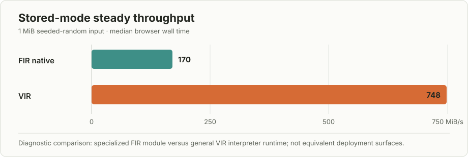
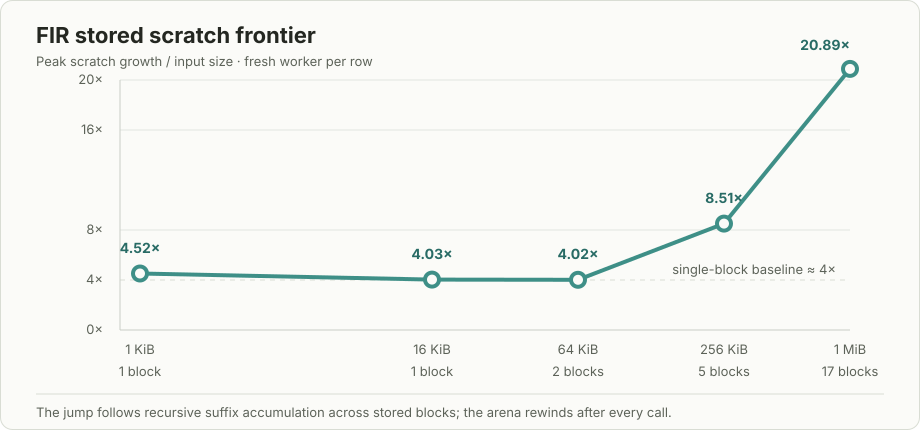
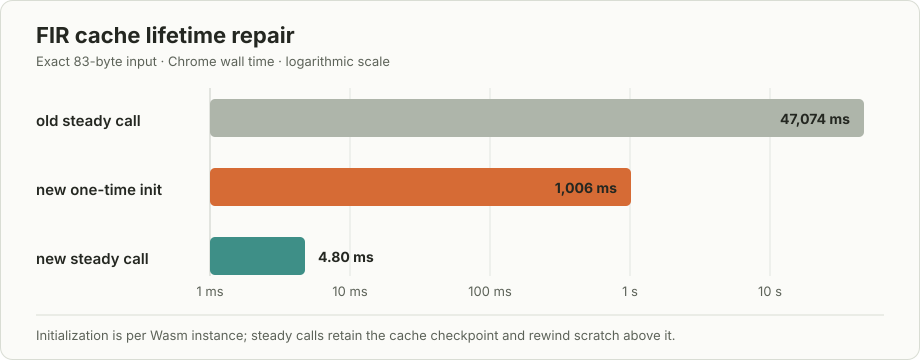

# VIR and FIR browser performance notes

These are local diagnostic results, not release claims. Every row used a fresh
browser worker, exact native lean-zip output comparison, and independent raw
inflate. All VIR rows use the package-set-lifetime cache landed in PR #131;
measurements from the known per-call-cache bug and deleted pre-merge worktree
are excluded.

## Artifact identity

- Chrome: headless 150.0.0.0 on Linux
- VIR main: `d43a947e65cec5dbda9e2393a5e74d1150ca144f`
  (`fix: persist IR interpreter caches across calls (#131)`)
- VIR profile: `client-native`
- VIR Wasm: 742,811 bytes,
  `a09ad75ada18d90c6aec881fdf5bd34537029c2c5be243e477102adb200e3f78`
- VIR browser runtime snapshot: 43 files / 925,039 bytes,
  `fbfda2cca0fb63ac69ffc43fbdd29ef107fa7807bdedce59f94a91fdcd5835df`
- VIR package input: 1,151,430 bytes,
  `3f3db6f2a75085f193e8dbe569d8b8ac53dceb9a789e2ef641df6665a711c1d7`
- FIR package producer: FIR `b25bf331`, lean-zip `30737b4e`
- FIR stored Wasm: 12,868 bytes,
  `3f36c0d334a6768ef183bbef1cce3eb60dd3ce1c4c5256dbec3d780a3e7daedb`
- FIR production Level-1 package:
  `b25bf3312d14-30737b4e2ebf-bd7323db4a28eee86d0c`
- FIR production Level-1 Wasm: 510,967 bytes,
  `cad8a411cc39b78d4396bd79df88dc6c874d85dd145620c02a6debd1b07c50ac`

## VIR compressed levels

Five browser samples at 64 KiB, after three excluded warmups, gave:

| input | level | native | VIR | VIR / native |
| --- | ---: | ---: | ---: | ---: |
| repeated text | 1 | 0.197 ms | 37.0 ms | 188x |
| repeated text | 6 | 0.766 ms | 209.1 ms | 273x |
| structured records | 1 | 0.142 ms | 47.8 ms | 338x |
| structured records | 6 | 0.865 ms | 352.6 ms | 408x |
| seeded random | 1 | 0.936 ms | 313.0 ms | 335x |
| seeded random | 6 | 4.00 ms | 1,330.9 ms | 333x |

Across these cells, VIR's `executeMs` accounts for 99.35–99.93% of its timed
steady call. Marshal, decode, and JavaScript host time do not explain the gap.
The wide client-native helpers execute inside the shared Wasm and are included
in `executeMs`.

The first compressed call remains intentionally cold. Compressible 64 KiB
inputs measured roughly 0.66–1.09 seconds before settling because the computed
32,769-entry distance table is constructed lazily. The fixed runtime retains
that value for the rest of the loaded package-set lifetime; it no longer pays
the cost on every public call.

Warm production-stage probes at level 6 further narrow the steady cost:

| 64 KiB input | whole | matcher | base preparation | remainder proxy |
| --- | ---: | ---: | ---: | ---: |
| structured records | 236 ms | 193 ms (81.7%) | 8.65 ms (3.7%) | 34.5 ms |
| seeded random | 1,239 ms | 923 ms (74.5%) | 158 ms (12.8%) | 158 ms |

The remainder is `whole - matcher - base` from isolated calls and is not an
additive profile. The direct level-6 entry emitted bytes identical to the whole
dispatcher. These results make the matcher/interpreter instruction path the
next VIR target; they do not support a JavaScript-boundary or missing-inline
explanation.

### VIR symbol-level attribution

A diagnostics-only Node/V8 profile then exercised the complete production
`VirLeanZipAcceptance.compressRaw` entry on Canterbury `alice29.txt` at level
6. The 152,089-byte input has SHA-256
`7467306ee0feed4971260f3c87421154a05be571d944e9cb021a5713700c38f0`;
the native-equal, independently inflatable 54,518-byte output has SHA-256
`762d58319c66b33a062da439d7bed7b33250493acb3bc2ceecdd05454ca34267`.
Two warmups, package loading, compilation, and instantiation were excluded.
Three production calls were sampled at a requested 100 microsecond interval.

The stripped release Wasm produced 45,557 valid samples but exposed only
`wasm-function[N]` names, so that capture is an intentionally inconclusive
symbolization control. Repeating with VIR's optimized unstripped companion
Wasm produced 51,850 symbolized samples:

| heuristic self-sample family | share |
| --- | ---: |
| IR body/expression evaluation | 25.5% |
| interpreter call/dispatch | 24.8% |
| declaration/symbol lookup | 24.8% |
| allocation/reference counting | 9.4% |
| frames/boxing/closures | 8.8% |
| native Lean/runtime calls | 6.3% |
| other/unattributed | 0.5% |

The leading individual symbols were `interpreter::call` at 24.8%,
`interpreter::eval_body` at 22.1%, the interpreter symbol-cache hash lookup at
16.7%, `memcmp` at 4.5%, `lean_dec_ref_cold` at 3.5%, `lookup_symbol` at 3.5%,
`eval_expr` at 3.3%, and `dlmalloc` at 3.3%. The client-native wide helpers
appear among the native calls but do not form a leading self-time bucket.

This refines the stage result: the first runtime experiment should remove or
amortize repeated interpreter-local symbol resolution at IR call sites, then
measure whether the combined `call`/`eval_body` dispatcher becomes the clear
ceiling. Allocation/reference counting is real but is not the first target.
This also rejects a lean-zip-specific missing-inline hypothesis for the current
gap; the dominant cost is generic interpreter machinery.

The symbolized Wasm is 3,923,468 bytes with SHA-256
`3bc9dad56bd4d0765f74115382fa03b5d9200262ce543ddac1ee51f4f65a2738`.
The producer checkout was VIR `15a4c5d`, a descendant of accepted `d43a947`;
the intervening commit changes surface-analysis tooling and no `web` or `wasm`
runtime source.
The raw symbolized profile is
`/tmp/lean-zip-vir-l6-alice-d43-symbolized.cpuprofile`, SHA-256
`4287179b5e987ee75e47ce50723e2dcb35e42f13a9b7e3ed9f30b3adb626e042`;
its identity/report packet is
`/tmp/lean-zip-vir-l6-alice-d43-symbolized.profile.json`, SHA-256
`91d801c40b492938e65c7a22d2bd840fb4c0a975dbc17d015c31dc28475ad05e`.
Profiled elapsed values are not headline timings.

## Stored level: FIR-native and VIR

The stronger stored runs use nine samples, ten excluded warmups, and twenty
iterations per sample on 1 MiB of seeded random bytes. Content should not
affect stored DEFLATE; random bytes make the source identity explicit.

| backend | median wall | throughput | execution share | relative MAD |
| --- | ---: | ---: | ---: | ---: |
| FIR native stored | 5.87 ms | 170 MiB/s | 79% | 16% |
| VIR stored | 1.34 ms | 748 MiB/s | 40% | 17% |

The relatively large dispersion is reported rather than hidden: garbage
collection, CPU scheduling, and browser tiering still affect this local page.
Independent clean passes placed FIR around 4.6–5.9 ms (170–216 MiB/s); the
landed VIR pass had clean samples from 1.1–2.8 ms. A controlled campaign needs
multiple order-balanced browser-process passes before release claims.

At 1 MiB, the displayed FIR run's median phase split was 0.287 ms encode,
4.616 ms execute, and 0.753 ms decode. Its 11.8 KiB package prepared in
11.6 ms, versus 90.2 ms for VIR's 1.89 MiB runtime plus package in that run.
FIR therefore has a much smaller deployment/startup surface, while VIR's
mature resident runtime is substantially faster once loaded. This setup
comparison is descriptive, not apples-to-apples: FIR is a specialized module
and VIR is a general IR interpreter.

FIR memory grows from 1 to 335 pages on the first 1 MiB input and then remains
at 335 pages across warmups and samples. The measured scratch frontier grows by
21,899,688 bytes and rewinds to 1,024 after every call, so this is retained
linear-memory capacity rather than a per-call leak. This roughly 20.9x peak
temporary-footprint multiplier is the clearest FIR optimization lead.

A fresh landed-artifact frontier sweep made the scaling mechanism explicit.
Each row used a fresh worker, three excluded warmups, three samples, seeded
random input, and the same exact-native/inflate gates. The peak frontier was
identical on the first call, every warmup, and every sample; every call rewound
to 1,024 bytes.

| input | stored blocks | scratch growth | growth / input | retained pages |
| ---: | ---: | ---: | ---: | ---: |
| 1 KiB | 1 | 4,624 B | 4.52x | 1 |
| 16 KiB | 1 | 66,064 B | 4.03x | 2 |
| 64 KiB | 2 | 263,168 B | 4.02x | 5 |
| 256 KiB | 5 | 2,230,960 B | 8.51x | 35 |
| 1 MiB | 17 | 21,899,688 B | 20.89x | 335 |

This is not a FIR leak or an unexplained allocator constant. The production
stored root calls recursive `deflateStoredPure`. Each level materializes a
slice and appends the already-built remaining stream. Compiled
`ByteArray.append` uses `ByteArray.copySlice` with geometric capacity growth.
FIR's resident helper correctly reuses a unique destination when it fits and
releases a consumed destination after growth, but its per-call bump arena does
not reuse that dead region before the final rewind. Intermediate suffix-sized
arrays therefore accumulate, making peak scratch proportional to input bytes
times the number of 65,535-byte stored blocks.

The cleanest experiment is application-side but backend-neutral: compile the
existing iterative `Zip.Native.Deflate.deflateStored` as a diagnostic root and
compare it with `deflateStoredPure`. If its unique accumulator yields linear
FIR scratch while retaining exact bytes, prove their equality and use the
iterative implementation behind the verified production specification. A FIR
free-list or mid-call arena compaction is a broader alternative, but it should
not be the first fix for this source shape. The fresh frontier packet is
`/tmp/lean-zip-fir-stored-frontier-current.json`, SHA-256
`3beb87b64378a7c146d7fb2b17d891610bcfade5e6499d0488c12058eb65e6af`.

## FIR production Level 1

The FIR lazy-cache repair is now integrated into a new immutable local package.
The v2 producer retains compiler cache globals, exports the idempotent
`fir_initialize_persistent_caches` function, invokes it once during adapter
preparation, and records the resulting frontier as the permanent lower bound
for per-call scratch rewinds. This is the generic two-region arena repair, not a
lean-zip-specific replacement table or JavaScript cache.

The 510,967-byte module contains 324 captured source functions and 1,553
resident helpers. It exports the compressor, persistent initializer, four arena
operations, and module-owned memory; it has zero imports and zero residual
runtime operations. Producer generation is byte-for-byte deterministic across
two emissions. Its five-case native/Wasm differential smoke includes 4 KiB and
8 KiB inputs and verifies initializer idempotence, exact native bytes,
independent inflate, and rewind to the persistent checkpoint.

For the exact 83-byte editable input, initialization moved the arena frontier
from 1,024 to 8,032,904 bytes. Chrome measured 1,006.48 ms for this one-time
work and 0.005 ms for the required second/idempotence call. The first compression
call then took 18.815 ms; after three excluded warmups, five steady samples had
a 4.795 ms median against native's 0.097 ms, or 49.2x. Both emitted the same
51-byte stream with SHA-256
`bf81f08e3915c22a555df36af296c5e3d0a4005ca0d393f60e9fbe6ba73da612`,
and independent raw inflate recovered the input. Steady FIR execution itself
was 4.715 ms; browser marshalling and decoding were 0.01 ms each.

This removes the old cache cliff: the superseded package took about 47,074 ms
per 83-byte call, so the new 4.795 ms browser median is approximately 9,800x
faster. A 200-call Node profile provides the cache-lifetime gate: median wall
time was 3.145 ms, every call began and ended at frontier 8,032,904, and every
call used exactly 430,552 bytes of scratch. No `distCodeWordBytes` initializer
appeared in the sampled call stacks. The remaining self samples are distributed
across the FIR runtime (59.6%), generic numeric helpers (19.6%), unattributed
work (13.1%), and lean-zip compressor functions (6.2%); this is the next
optimization surface, not another cache-lifetime failure.

The broader Chrome gate covers repeated, structured, random, and zero data at
1 KiB, 16 KiB, 64 KiB, 256 KiB, and 1 MiB: all 20 cells are native-byte-equal
and independently inflatable. Median ranges across the four inputs were:

| input bytes | native | FIR | FIR / native | retained Wasm pages |
| ---: | ---: | ---: | ---: | ---: |
| 1 KiB | 0.042–0.141 ms | 4.21–14.73 ms | 51.7–104.4x | 129–135 |
| 16 KiB | 0.052–0.207 ms | 6.58–15.84 ms | 42.2–161.2x | 131–135 |
| 64 KiB | 0.052–0.833 ms | 6.02–20.01 ms | 24.0–115.2x | 134–141 |
| 256 KiB | 0.066–2.749 ms | 7.06–39.15 ms | 14.2–106.5x | 149–183 |
| 1 MiB | 0.336–11.238 ms | 11.54–127.81 ms | 11.4–41.6x | 209–532 |

At 1 MiB, scratch above the persistent checkpoint ranged from 5,653,832 bytes
for zeros to 26,766,928 bytes for seeded random data, and was rewound after
each call. This is sufficiently bounded for the comparison lab's existing
1 MiB global limit, so the obsolete 96-byte FIR safety cap has been removed.
The new timing is practical for the demo, though FIR remains 11–42x slower than
native at 1 MiB and pays roughly one second once per Wasm instance to construct
its retained tables.

The exact Chrome report is
`/tmp/lean-zip-fir-fixed-browser-exact-83.json`, SHA-256
`642a19f3ea397fa3c2c93d78e1f300429fbffa16bf8970646650b3267bdc2bc4`.
The 20-cell sweep is `/tmp/lean-zip-fir-fixed-browser-sweep.json`, SHA-256
`60486c8964ad961c5285f9a89dd1f9b03614d26a406ee2ef1b29237291294a6b`.
The 200-call named profile and report have SHA-256
`8ffcdcc7ad786f117a75f5a57e5ae001c2dbfc3d96c00dfeb13e7c2af1512ca4`
and `3494f5ad5141a5d2f5d89b9ac58dfcb33edbeab570bd6794cf1b08b0f946a809`.

## FIR production levels 1–10

The full `compressRaw` producer and consumer paths are implemented, including
the two-argument ABI, reviewed standard-math runtime link, runtime-memory
reservation, zero-import package validation, and level-aware browser worker.
There are deliberately no timing rows or artifact identity here yet: the first
producer execution gate found that FIR's persistent initializer eagerly forces
an unreachable panic-only lazy constant before any input is encoded. The raw
package remains unattached until that generic cache-semantics defect is fixed
and every level passes native byte equality plus independent inflate.

## Next measurements

1. Preserve lazy semantics in FIR's persistent-cache initialization, then run
   the full 5-case × 10-level producer gate and attach the resulting immutable
   `compressRaw` package only if all cells pass.
2. Reduce FIR's roughly one-second instance initialization, then profile the
   steady generic numeric/runtime path on representative larger inputs.
3. Ask VIR to screen an interpreter-call-site symbol-resolution cache or
   equivalent resolved-call representation against the existing symbolized
   profile; accept only with a fresh profile and order-balanced representative
   runs.
4. Add an iterative stored diagnostic root, measure its FIR frontier against
   the recursive root, and pursue a proof-backed production substitution only
   if the predicted linear scratch behavior appears.

Local evidence packets used for this note were written under `/tmp` by
`npm run bench:vir` and `npm run bench:fir`; the commands and JSON schema are
documented in the sibling README. The landed-main 27-cell sweep is
`f9640a0817ebc93d990f90547a187438775524730a46790feb84f652edc660fd`,
and the 1 MiB stored control is
`9f74d72ff56536105e2f102797d088977f9aeb383d4d2f2fcffa210c86733c36`.
